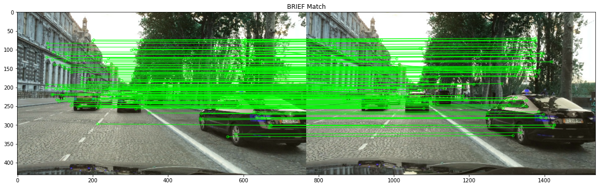
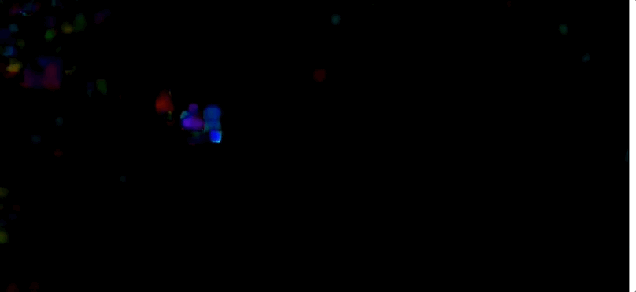
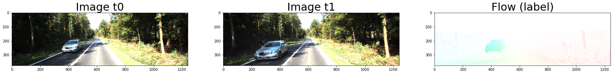
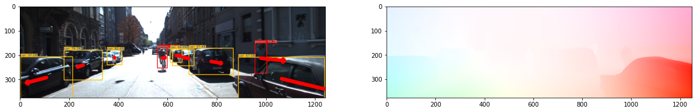
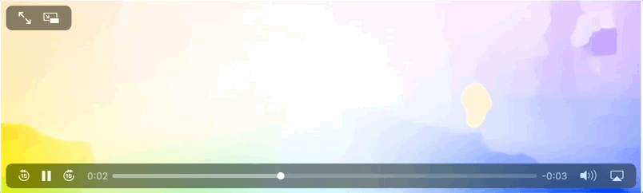
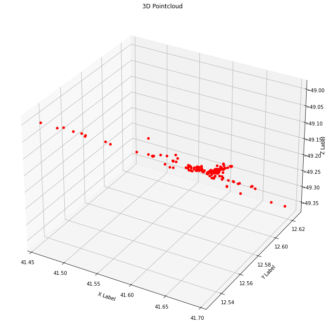

# Optical Flow and Deep Learning

A set of projects that illustrate different approches to Optical Flow.

## Projects

[Optical Flow](OpticalFlow) explores three techniques to tackle the tracking problem:

1. [Feature_Tracking.ipynb](OpticalFlow/Feature_Tracking.ipynb) illustrates how to detect and track features across consecutive images.

2. [Sparse_Optical_Flow.ipynb](OpticalFlow/Sparse_Optical_Flow.ipynb) illustrates how to use sparse optical flow on images and videos.

3. [Dense_Optical_Flow.ipynb](OpticalFlow/Dense_Optical_Flow.ipynb) illustrates how to use dense optical flow on images and videos.

[FlowNet](FlowNet) illustrates Deep Learning for Optical Flow by implementing the FlowNet algorithm using PyTorch and training the models on the KITTI dataset. The goal is to output the optical flow of two images.

[RAFT](RAFT) explores the RAFT deep network architecture for optical flow.

Here is the same video  of the skateboarder as used above to illustrate sparse and dense optical flow, this time using RAFT:

[Visual SLAM](VisualSLAM) shows an example of Visual SLAM (Simultaneous Localization and Mapping) using visual features.

## Datasets

**The KITTI Vision Benchmark Suite**

The stereo 2015 / flow 2015 / scene flow 2015 benchmark consists of 200 training scenes and 200 test scenes (4 color images per scene, saved in lossless png format). 

Geiger, A, P. Lenz, R. URtasun, 2015. [Optical Flow Evaluation 2015](http://www.cvlibs.net/datasets/kitti/eval_scene_flow.php?benchmark=flow). The KITTI Vision Benchmark Suite: A project of Karlsruhe Institute of Technology and Toyota Technological Institute at Chicago.

**HD1K Benchmark Suite**

The [HD1K Benchmark Suite](http://hci-benchmark.iwr.uni-heidelberg.de) is an autnonomous driving dataset and benchmark for optical flow. The public training dataset contains:
* More than 1000 frames at 2560x1080 with diverse lighting and weather scenarios
* reference data with error bars for optical flow
* evaluation masks for dynamic objects
* specific robustness evaluation on challenging scenes

**The "Flying Chairs" Dataset**

The ["Flying Chairs"](https://lmb.informatik.uni-freiburg.de/resources/datasets/FlyingChairs.en.html#flyingchairs) are a synthetic dataset with optical flow ground truth. It consists of 22872 image pairs and corresponding flow fields. Images show renderings of 3D chair models moving in front of random backgrounds from Flickr. Motions of both the chairs and the background are purely planar.

**Scene Flow Datasets: FlyingThings3D, Driving, Monkaa**

The [Scene Flow Datasets collection](https://lmb.informatik.uni-freiburg.de/resources/datasets/SceneFlowDatasets.en.html) contains more than 39000 stereo frames in 960x540 pixel resolution, rendered from various synthetic sequences. [Mayer, et al (2016)](#references) reference and describe these datasets.

**MPI Sintel Flow Dataset**

The [MPI Sintel Flow Dataset](http://sintel.is.tue.mpg.de) is a data set for the evaluation of optical flow derived from the open source 3D animated short film, [Sintel](https://durian.blender.org).

## References
* Dosovitskiy, A., Fischer, P., Ilg, E., Hausser, P., Hazirbas, C., Golkov, V., Van Der Smagt, P., Cremers, D. and Brox, T., 2015. [Flownet: Learning optical flow with convolutional networks](https://arxiv.org/pdf/1504.06852). In Proceedings of the IEEE international conference on computer vision (pp. 2758-2766).
* Teed, Z. and Deng, J., 2020, August. [RAFT: Recurrent all-pairs field transforms for optical flow](https://arxiv.org/pdf/2003.12039). In European conference on computer vision (pp. 402-419). Springer, Cham.
* Okafuji, Y. and Fukao, T., 2021. [Theoretical interpretation of drivers’ gaze strategy influenced by optical flow](https://www.nature.com/articles/s41598-021-82062-1). Scientific reports, 11(1), 2389 (2021) pp.1-14. [https://doi.org/10.1038/s41598-021-82062-1](https://doi.org/10.1038/s41598-021-82062-1)
* Ullah, A., Ahmad, J., Muhammad, K., Sajjad, M. and Baik, S.W., 2017. [Action recognition in video sequences using deep bi-directional LSTM with CNN features](https://ieeexplore.ieee.org/stamp/stamp.jsp?tp=&arnumber=8121994). IEEE access, 6, pp.1155-1166 Vancouver.
* Zhu, Y., Lan, Z., Newsam, S. and Hauptmann, A., 2018, December. [Hidden two-stream convolutional networks for action recognition](https://arxiv.org/pdf/1704.00389.pdf). In Asian conference on computer vision (pp. 363-378). Springer, Cham.
* Wikipedia. [Taylor Series](https://en.wikipedia.org/wiki/Taylor_series).
* Wikipedia. [Lucas–Kanade method](https://en.wikipedia.org/wiki/Lucas–Kanade_method).
* Wikipedia. [Video detection and ranging (VIDAR)](https://en.wikipedia.org/wiki/Video_detection_and_ranging).
* Chuan-en Lin, 2019. [Introduction to Motion Estimation with Optical Flow](https://nanonets.com/blog/optical-flow/).
* Ilg, E., Mayer, N., Saikia, T., Keuper, M., Dosovitskiy, A. and Brox, T., 2017. [Flownet 2.0: Evolution of optical flow estimation with deep networks](https://openaccess.thecvf.com/content_cvpr_2017/papers/Ilg_FlowNet_2.0_Evolution_CVPR_2017_paper.pdf). In Proceedings of the IEEE conference on computer vision and pattern recognition (pp. 2462-2470).
* Ziyun Li, 2017. [A Brief Review of FlowNet](https://towardsdatascience.com/a-brief-review-of-flownet-dca6bd574de0). towardsdatascience.
* Ranjan, A. and Black, M.J., 2017. [Optical flow estimation using a spatial pyramid network](https://openaccess.thecvf.com/content_cvpr_2017/papers/Ranjan_Optical_Flow_Estimation_CVPR_2017_paper.pdf). In Proceedings of the IEEE conference on computer vision and pattern recognition (pp. 4161-4170).
* Mayer, N., Ilg, E., Hausser, P., Fischer, P., Cremers, D., Dosovitskiy, A. and Brox, T., 2016. [A large dataset to train convolutional networks for disparity, optical flow, and scene flow estimation](https://openaccess.thecvf.com/content_cvpr_2016/papers/Mayer_A_Large_Dataset_CVPR_2016_paper.pdf). In Proceedings of the IEEE conference on computer vision and pattern recognition (pp. 4040-4048).

**University Courses**
* Fei‐Fei Li, 2011. [Tracking motion features – optical flow](http://vision.stanford.edu/teaching/cs231a_autumn1112/lecture/lecture13_optical_flow_cs231a.pdf). Stanford Vision Lab.
* Derek Hoiem. [Feature Tracking and Optical Flow](https://courses.engr.illinois.edu/cs543/sp2012/lectures/Lecture%2008%20-%20Feature%20Tracking%20and%20Optical%20Flow%20-%20Vision_Spring2012.pdf) Computer Vision CS 543 / ECE 549, University of Illinois.

**Software Implementations**
* Ruoteng Li 李若腾. [Optical Flow Toolkit](https://github.com/liruoteng/OpticalFlowToolkit).
* Clement Pinard. [FlowNetPytorch](https://github.com/ClementPinard/FlowNetPytorch). FlowNet implementation in PyTorch.
* Zachary Teed and Jia Deng. [Source Code from the paper _RAFT: Recurrent All Pairs Field Transforms for Optical Flow_](https://github.com/princeton-vl/RAFT).
* Chuan-en Lin. [Source code for the article _'Motion Estimation with Optical Flow'_](https://github.com/chuanenlin/optical-flow)
